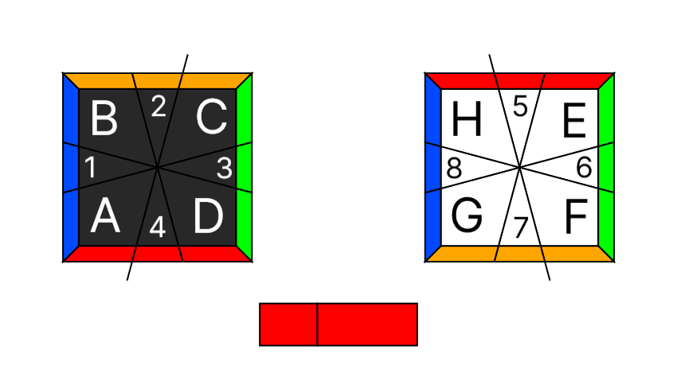

# How to Read `virtual-sq1`'s notation

`virtual-sq1` uses (almost*) the same position notation as [Jaap's Square-1 optimiser](https://www.jaapsch.net/puzzles/square1.htm#progs).

The diagram above shows a solved Square-1 with an alphanumeric symbol on each piece. These symbols will represent the pieces they are on.

The position state of a Square-1 is read **starting from the top layer** (on the left side of the diagram), from just **clockwise of the slice**, and with the **small red side of the equator in front** (at the bottom of the diagram). Once you are done with the top layer, move on to the bottom layer, continuing from just **clockwise of the slice**.

For example, this state in the diagram above is read as:
- Top Layer: **A1B2C3D4**
- Bottom Layer: **5E6F7G8H**

The equator is represented by a "**-**" if **solved** (not flipped) and a "**/**" if **unsolved** (flipped). 

So the complete state of the Square-1 in the diagram above is **A1B2C3D4-5E6F7G8H**.

  

<footnote>*</footnote> The only difference between the two styles is that `virtual-sq1`'s notation has the equator's symbol *between* the two layers' states, whereas Jaap's Square-1 optimiser has the equator's symbol *after* the layers' states. I opted to make this small change so it would be easier to distinguish between the top and bottom layers.

  

# [Back to README 🔗](../README.md)
